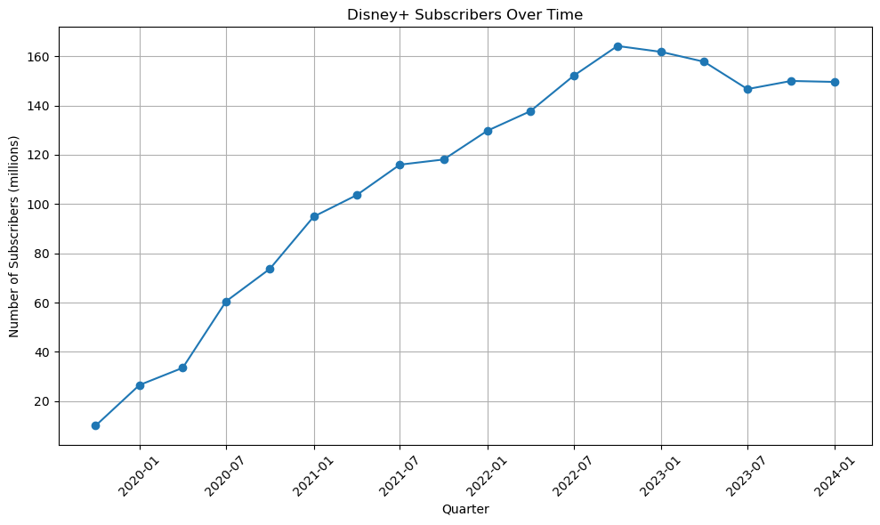
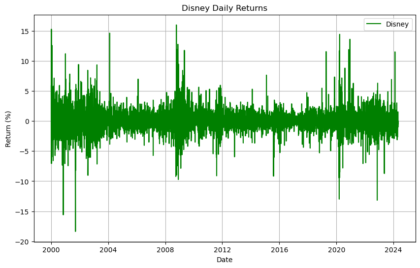

# [Fin 377 Final Project](https://sammiopalewski.github.io/FinalProjectWebsite/)

This is a website to showcase our final project for FIN 377 - Data Science for Finance course at Lehigh University.


## Table of contents
1. [Introduction](#introduction)
2. [Methodology](#meth)
3. [Section 2](#section2)
    1. [Subsection](#subsec2-1)
    2. [Subsection](#subsec2-2)
4. [Analysis Section](#section3)
5. [Summary](#summary)

## Introduction  <a name="introduction"></a>

(The "Introduction" text above is formatted in heading 2 style.) The main goal of this project is to explore the relationship between subscriber count of streaming services and stock returns of subsidiary companies. We will also be looking at how specific events impacted the stock returns and subscriber counts in a dashboard linked [here](https://finalproject-bt8gkfbzkptf7gkk8yhyka.streamlit.app/).   

## Methodology <a name="meth"></a>

Here is some code that we used to develop our analysis. This is the code we used to conduct our regression analysis between subscriber count and stock returns for Disney Disney Plus respectively. We repeated these regressions. The methodology for the event analysis in found on our dashboard as well as in our report. 

Note that for the purposes of the website, you have to copy this code into the markdown file and  
put the code inside trip backticks with the keyword `python`.

```python
import pandas as pd
import numpy as np
from sklearn.linear_model import LinearRegression

# Filter dates for stock returns to specific order
filtered_returns_df_disney = disney_data_ret[['Date', 'Close', 'Adj Close']]

# Filter for specific dates
specific_dates = ['2019-10-01', '2020-01-02', '2020-02-01', '2020-07-01', '2020-10-01' , '2021-01-04' , '2021-04-01' , 
                  '2021-07-01' , '2021-10-01' ,'2022-01-03' , '2022-04-01' , '2022-07-01' , '2022-10-03' , '2023-01-03'
                  '2023-04-03' , '2023-07-03' , '2023-10-02' , '2024-01-02']
filtered_returns_df_disney = filtered_returns_df_disney[filtered_returns_df_disney['Date'].isin(specific_dates)]

print(filtered_returns_df_disney)

# Print the DataFrame after preprocessing
print("Preprocessed Subscriber DataFrame:")
print(disney_data_sub_reg)

# Merge the filtered dataframe with the subscribers dataframe based on the date column
merged_df_disney = pd.merge(filtered_returns_df_disney, disney_data_sub_reg, on='Date', how='inner')
print(merged_df_disney)

disney_quarter_return = merged_df_disney['Adj Close'].pct_change() * 100

# Adding a new column titled 'quarter_return'
merged_df_disney['quarter_return'] = disney_quarter_return

# Printing the updated DataFrame
print(merged_df_disney)


merged_df_disney.dropna(subset=['quarter_return', 'Number of Subs (mil)'], inplace=True)

# Reshape X to a 2D array
X = merged_df_disney['quarter_return'].values.reshape(-1, 1)
y = merged_df_disney['Number of Subs (mil)']


model = LinearRegression()
model.fit(X, y)


slope = model.coef_[0]
intercept = model.intercept_

print("Regression Equation: y = {:.2f}x + {:.2f}".format(slope, intercept))

# Calculate R-squared
r_squared = model.score(X, y)


print("R-squared:", r_squared)
```

**You have to copy in figures and tables from the notebooks.**

## Section <a name="section2"></a>


### Subsection 1 <a name="subsec2-1"></a>
This is a subsection, formatted in heading 3 style

### Subsection 2 <a name="subsec2-2"></a>
This is a subsection, formatted in heading 3 style

## Analysis Section <a name="section3"></a>
The result of the regression was  y = -0.70x + 115.28 , and R^2 was 0.10155459640541864. This means that 10.16 % of the variability in stock returns explains the relationship between stock returns and subscriber counts. This R^2 is very low. Also, a negative slope means that as the stock return increased, the subscriber count decreased. As mentioned in our report, the small r^2 was not what we were expecting, and some of the other regressions had an even lower r^2. This could be do to many things. What sticks out to us is that there are many factors that can effect a companies stock, not just the increase in subscriber accounts of a owned streaming service. 

Here are some graphs that we created in our analysis. We saved them to the `pics/` subfolder and include them via the usual markdown syntax for pictures.


<br><br>
As you can see, there is a relatively constant increase in quarterly subsciber count between the years of 2020 and 2023. After that the subscriber count plateaued and stayed roughly constant. 
<br><br>

<br><br>
Here we have the daily returns of disney stock between 2000 and 2024. Through these two graphs, we can't completely tell if there is a relationship between the two, so we ran a regression model. The rest of the graphs the contain suberscriber count over time as well as stock returns over time are in the pics folder of this repo. 
<br><br>

<br><br>
More analysis.

## Summary <a name="summary"></a>

Blah blah


## About the team
Sammi Opalewski 
<br>
.JPEG)

Sammi is a junior majoring in Finance and minoring in Applied Mathematics. 
<br>
Chris Toh
<br>
Chris is a senior majoring in IBE Financial Engineering.
<br><br><br>

<br>
Sam Fleetwood
<br>
Sam is a senior majoring in IBE Finance and Industrial Engineering. 

<br>
Matt Slaski
<br>
Matt is a senior majoring in IBE Finance. 
<br><br><br>

<br>


## More 

To view the GitHub repo for this website, click [here](https://github.com/donbowen/teamproject).
